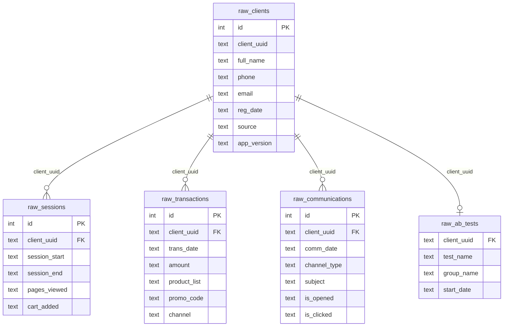

# Customer LTV & Cohort Analysis Project (Спортивная Платформа)

Проект посвящен комплексному исследованию пользовательской активности, когортному анализу метрик удержания (Retention Rate) и пожизненной ценности (Lifetime Value) платящей аудитории спортивной платформы. 

Проект реализуется итеративно: от разведочного анализа и аудита качества данных (Data Quality) до проектирования корпоративного хранилища данных (DWH).

---

## 🚀 Дорожная карта проекта (Roadmap)

- [x] **Этап 1: Базовый когортный анализ и аудит качества данных**
  - Сборка сырых логов транзакций в когорты.
  - Локализация аномалий в данных (дубликаты, "сиротские" покупки).
  - Переход от модели User Retention к модели Paying Retention.
- [x] **Этап 2: Глубокое исследование аномалий (Data Quality Deep Dive)**
  - Поиск причин календарных всплесков активности в январе и августе 2026 года.
  - Анализ аномального роста удержания на первом месяце жизни у свежих когорт.
- [ ] **Этап 3: Проектирование архитектуры DWH**
  - Разработка многомерной модели данных (схема «Звезда» / «Снежинка»).
  - Создание таблиц фактов (`f_transactions`) и измерений (`dim_users`).
- [ ] **Этап 4: Автоматизация и Визуализация**
  - Оптимизация расчетов витрин данных.
  - Построение интерактивного дашборда в BI-системе.

---

## 📊 Ключевые результаты Этапа 1

В ходе первой итерации был проведен аудит сырых данных, который выявил две критические проблемы, ломавшие классическую математику когортного анализа (удержание превышало 100%):
1. **Проблема дубликатов:** Обнаружено 3 455 дублирующих строк в таблице регистраций.
2. **Проблема "сиротских" транзакций:** Выявлено, что 22.6% (4 907 покупок) совершены пользователями без подтвержденного факта регистрации.

**Решение:** Логика расчета была полностью перестроена с модели User Retention на модель **Paying Retention** (когортирование по дате первой фактической покупки). Это позволило очистить метрики от шума и получить коммерчески точные результаты.

### Инсайты по матрице удержания (Retention Rate):
* **Рост вовлеченности аудитории:** Новые когорты возвращаются в продукт в 3–4 раза эффективнее старых. Retention 1-го месяца вырос с **3.9%** (в начале 2025 года) до **41.8%** (в середине 2026 года).
* **Сезонный триггер:** Четко локализованы вертикальные календарные полосы активности в **январе и августе 2026 года**, когда синхронно активизировались клиенты всех исторических когорт (эффект масштабных распродаж).

### Инсайты по деньгам (Накопительный LTV):
* **Рост монетизации:** Средний чек первой покупки (Month 0) увеличился с ~6 000 руб. до ~11 000 руб.
* **Скорость окупаемости:** Из-за высокого удержания новые когорты приносят в два раза больше денег на одной и той же дистанции: к 4-му месяцу жизни клиент 2026 года приносит в среднем **14 233 руб.** против **8 929 руб.** у клиента начала 2025 года.

---

## 🛠 Технологический стек
* **База данных:** PostgreSQL
* **Язык запросов:** SQL (Оконные функции, сложные CTE, фильтрация данных)
* **Анализ и визуализация:** Python (Pandas, Seaborn, Matplotlib, SQLAlchemy)

## Схема базы данных (Сырые данные / RAW)

