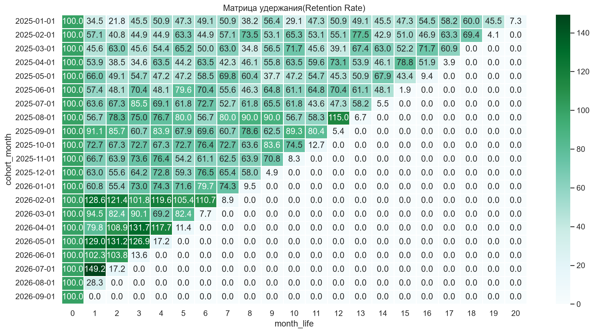
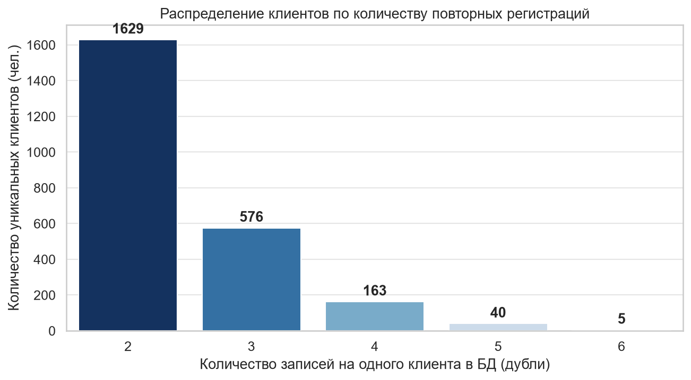
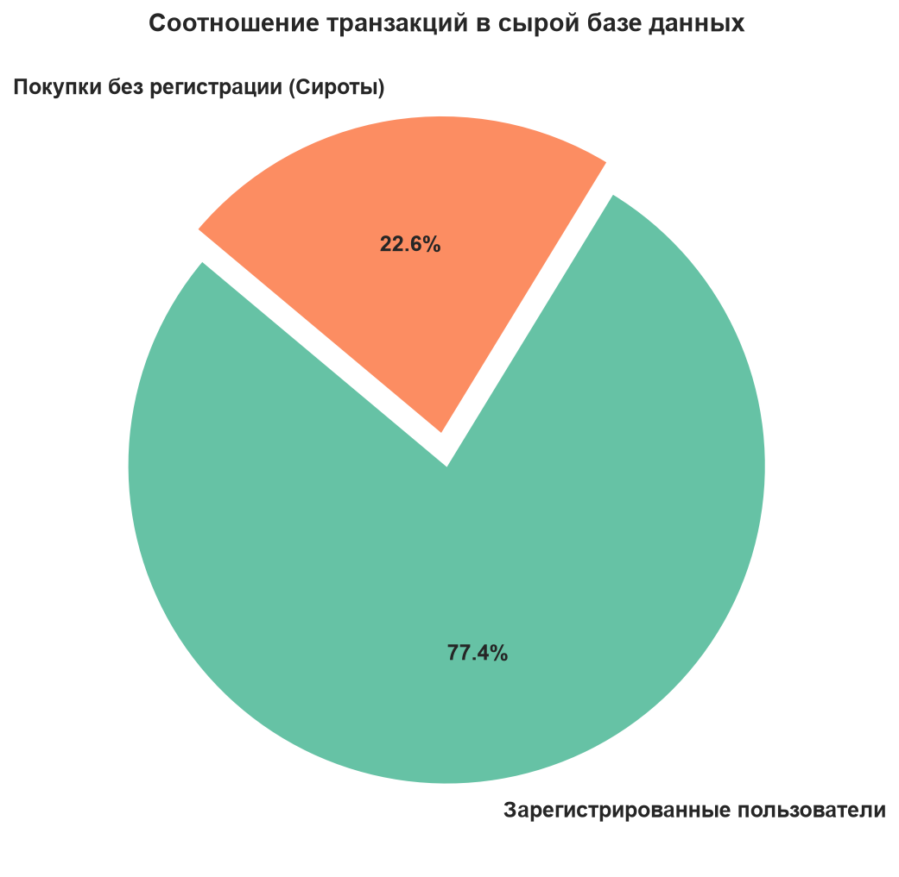
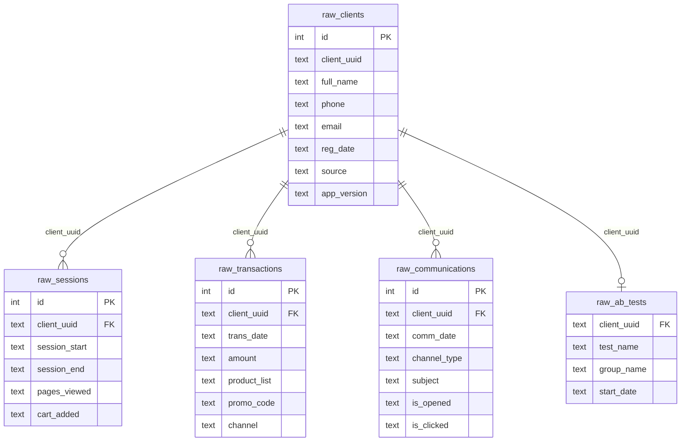

# Customer LTV & Cohort Analysis Project (Спортивная Платформа)

> ⚠️ **СТАТУС ПРОЕКТА: В АКТИВНОЙ РАЗРАБОТКЕ**  
> Проект реализуется итеративно. Текущий фокус — завершение аналитического исследования транзакций и развертывание базового DWH-ядра продаж. Остальные модули хранилища находятся в процессе проектирования и будут добавляться пошагово.

---


# Customer LTV & Cohort Analysis Project (Спортивная Платформа)

Проект посвящен комплексному исследованию пользовательской активности, когортному анализу метрик удержания (Retention Rate) и жизненной ценности (Lifetime Value) платящей аудитории спортивной платформы. 

Проект реализуется итеративно: от разведочного анализа и аудита качества данных (Data Quality) до проектирования корпоративного хранилища данных (DWH).

---

## 🚀 Дорожная карта проекта (Roadmap)

- [x] **Этап 1: Базовый когортный анализ и аудит качества данных**
  - Сборка сырых логов транзакций в когорты.
  - Локализация аномалий в данных (дубликаты, "сиротские" покупки).
  - Переход от модели User Retention к модели Paying Retention.
- [x] **Этап 2: Глубокое исследование аномалий (Data Quality Deep Dive)**
  - Поиск причин календарных всплесков активности в январе и августе 2026 года.
  - Анализ аномального роста удержания на первом месяце жизни у свежих когорт.
- [x] **Этап 3: Проектирование архитектуры DWH**
  - Разработка многомерной модели данных (схема «Звезда» / «Снежинка»).
  - Создание таблиц фактов (`f_transactions`) и измерений (`dim_users`).
- [ ] **Этап 4: Автоматизация и Визуализация**
  - Оптимизация расчетов витрин данных.
  - Построение интерактивного дашборда в BI-системе.

---

## 📊 Ключевые результаты Этапа 1


<details>
<summary>🔍 Посмотреть SQL-запрос для формирования когортного анализа </summary>

```sql
-- Формируем таблицу с датой регистрацией
with reg_dt_client as (
	select
		client_uuid,
		min(reg_date::date) as data_reg
	from raw.raw_clients
	where reg_date is not null -- отсекаем клиентов без даты регистрации
	group by client_uuid -- группируем по ID клиента для того чтобы вытащить первую дату регистрации
),
-- Добавляем дату каждой покупки и сумму покупки по каждому клиенту
client_transactions as (
	select
		r.client_uuid,
		r.data_reg,
		rt.trans_date::date as trans_date,
		nullif(amount, 'error')::numeric as amount
		from reg_dt_client r
		left join raw.raw_transactions rt on r.client_uuid = rt.client_uuid
),
-- Формируем таблицу "жизненного цикла"
client_lifecycle as (
	select
		client_uuid,
		date_trunc('month',data_reg):: date as cohort_month, -- Определяем когорту каждого клиента
		coalesce(
		(extract(year from trans_date)*12 + extract(month from trans_date)) -
		(extract(year from data_reg)*12 + extract(month from data_reg)),
		0) as month_life, -- Определяем жизненный цикл
		amount
	from client_transactions
),
-- Создаём таблицу с агрегированными данными по каждой когорте
cohort_aggregated as (
	select
		cohort_month,
		month_life,
		sum(amount) as total_amount,
		count(distinct(client_uuid)) as number_of_users
		from client_lifecycle
		group by cohort_month,month_life
 )
 -- Формируем финальную таблицу для когортного анализа добавляя метрики (retention,ltv)
select
	cohort_month,
	month_life,
	total_amount,
	number_of_users,
	round(number_of_users * 100.0 / first_value(number_of_users) over (partition by cohort_month order by month_life asc),2) as retention,
	round(sum(total_amount) over (partition by cohort_month order by month_life asc) / first_value(number_of_users) over (partition by cohort_month order by month_life asc),0) as ltv
from cohort_aggregated
order by cohort_month
```
</details>

### Визуализация матрицы удержания (Первичный анализ сырых данных)

В ходе первой итерации был проведен аудит сырых данных, который выявил две критические проблемы, ломавшие классическую математику когортного анализа (удержание превышало 100%):
1. **Проблема дубликатов:** Обнаружено 3 455 дублирующих строк в таблице регистраций.
### Визуализация Распределение клиентов по количеству повторных регистраций (анализ данных в таблице raw_clients)

<details>
<summary>🔍 Посмотреть SQL-запрос для анализа дублей </summary>

```sql
select
	client_uuid,
	count(*)
from raw.raw_clients
group by client_uuid
having count(*) > 1
```
</details>

2. **Проблема "сиротских" транзакций:** Выявлено, что 22.6% (4 907 покупок) совершены пользователями без подтвержденного факта регистрации.
### Визуализация соотношения транзакций в бд

**Решение:** Логика расчета была полностью перестроена с модели User Retention на модель **Paying Retention** (когортирование по дате первой фактической покупки). Это позволило очистить метрики от шума и получить коммерчески точные результаты.
### Визуализация модель **Paying Retention**
.png)
### Инсайты по матрице удержания (Retention Rate):
* **Рост вовлеченности аудитории:** Новые когорты возвращаются в продукт в 3–4 раза эффективнее старых. Retention 1-го месяца вырос с **3.9%** (в начале 2025 года) до **41.8%** (в середине 2026 года).
* **Сезонный триггер:** Четко локализованы вертикальные календарные полосы активности в **январе и августе 2026 года**, когда синхронно активизировались клиенты всех исторических когорт (эффект масштабных распродаж).

### Инсайты по деньгам (Накопительный LTV):
* **Рост монетизации:** Средний чек первой покупки (Month 0) увеличился с ~6 000 руб. до ~11 000 руб.
* **Скорость окупаемости:** Из-за высокого удержания новые когорты приносят в два раза больше денег на одной и той же дистанции: к 4-му месяцу жизни клиент 2026 года приносит в среднем **14 233 руб.** против **8 929 руб.** у клиента начала 2025 года.

## 📊 Ключевые результаты Этапа 2 (Data Quality & Deep Dive)

В ходе детального исследования природы календарных аномалий (пики удержания в январе и августе 2026 года) были выгружены сырые логи транзакций и проведен их статистический анализ (`.describe()` и визуализация распределения):

* **Опровержение гипотезы о сбоях/выбросах:** Анализ показал, что средний чек в аномальные месяцы (~7 214 руб.) практически равен медиане (~7 007 руб.), а максимальный чек (14 992 руб.) находится в пределах нормы. Это доказывает, что пики вызваны не техническим дублированием логов или единичными оптовыми закупками "китов", а реальным массовым наплывом уникальных розничных клиентов в периоды сезонных распродаж.
* **Обнаружение природы данных:** Гистограмма распределения чеков выявила идеальное **равномерное распределение** (Uniform Distribution) — во всех ценовых диапазонах от 0 до 15 000 рублей совершается стабильно по 50–85 покупок. Это является прямым техническим маркером того, что исходные данные имеют синтетическое (программно сгенерированное) происхождение.
* **Локализация возвратов:** В сырых логах обнаружены отрицательные чеки (`min = -475.22 руб.`), сигнализирующие об операциях возврата (refunds), что было учтено при проектировании логики ETL/ELT.

---

## 🏗️ Ключевые результаты Этапа 3 (Архитектура и наполнение DWH)

Для обеспечения долгосрочной масштабируемости аналитики и очистки метрик от шума, сырые данные из схемы `raw` были реструктурированы и перенесены в слой хранилища `dwh` по многомерной схеме «Звезда» (Star Schema):

1. **Создан эталонный справочник пользователей (`dwh.dim_users`):** Данные полностью очищены от 3 455 дубликатов. Каждому уникальному `client_uuid` присвоен быстрый числовой суррогатный ключ (`id SERIAL`) и жестко прописан его истинный месяц когорты по дате первой фактической покупки.
2. **Создан динамический справочник товаров (`dwh.dim_products`):** Текстовые списки покупок были дедуплицированы и развернуты в плоский справочник уникальных наименований.
3. **Разработана и наполнена таблица фактов продаж (`dwh.f_order_items`):** 
   * Реализован сложный ELT-процесс: с помощью встроенной функции PostgreSQL `STRING_TO_TABLE` текстовые строки покупок (например, `Tshirt,Jacket`) были «нарезаны» на отдельные физические строки товаров.
   * Поскольку в сырых данных отсутствовал номер чека, был сгенерирован синтетический `order_id` на базе композитного ключа «Клиент + Время» с помощью оконной функции `DENSE_RANK()`.
   * Решена проблема отсутствия прайс-листа: общая сумма чека была пропорционально распределена между товарами внутри заказа с помощью оконного подсчета `COUNT(*) OVER (PARTITION BY order_id)`.
   * Выстроено разделение финансовых потоков: на базе конструкции `CASE WHEN` операции были разделены на покупки и возвраты со ссылкой на технический справочник `dwh.dim_transaction_types`.

### 🔄 Пример трансформации данных (Data Transformation: RAW to DWH)

Для наглядности приведем пример того, как «грязная» текстовая строка из сырого лога транзакций трансформируется внутри СУБД PostgreSQL и раскладывается на атомарные аналитические строки в слое DWH:

**1. Как данные выглядели в сыром слое (`raw.raw_transactions`):**
*Здесь нет номеров чеков, товары лежат кашей в одной ячейке, а сумма указана за всё событие целиком.*

| client_uuid | trans_date | amount | product_list | channel |
| :--- | :--- | :--- | :--- | :--- |
| e7e5b924-4109-48d3-adc0-d99ae6505492 | 2026-03-03 01:31:16 | 5544.49 | Tshirt,Jacket | offline |

**2. Как эти же данные легли в разработанную таблицу фактов хранилища (`dwh.f_order_items`):**
*Сгенерирован единый `order_id` для чека, UUID заменен на числовой `user_id` из справочника, список товаров разделен на отдельные строки, а сумма чека честно распределилась пропорционально количеству товаров.*

| id | order_id | user_id | product_id | transaction_type_id | allocated_amount | trans_date | channel |
| :--- | :--- | :--- | :--- | :--- | :--- | :--- | :--- |
| **1** | 150 | 42 | 3 *(Tshirt)* | 1 *(Покупка)* | **2772.25** | 2026-03-03 01:31:16 | offline |
| **2** | 150 | 42 | 7 *(Jacket)* | 1 *(Покупка)* | **2772.25** | 2026-03-03 01:31:16 | offline |

---


---

### 💻 Исходный SQL-код развертывания DWH слоя (DDL & ELT)

Ниже представлены рабочие SQL-скрипты, с помощью которых была развернута физическая структура хранилища в PostgreSQL и осуществлена миграция данных.

<details>
<summary>🔍 1. Скрипт создания схем и справочников (DDL)</summary>

```sql
-- Создание изолированных слоев хранилища
CREATE SCHEMA IF NOT EXISTS raw;
CREATE SCHEMA IF NOT EXISTS dwh;

-- Справочник пользователей
CREATE TABLE dwh.dim_users (
    user_id SERIAL PRIMARY KEY,
    client_uuid uuid NOT NULL,
    cohort_month DATE NOT NULL
);

-- Справочник товаров
CREATE TABLE dwh.dim_products (
    product_id SERIAL PRIMARY KEY,
    product_name VARCHAR(255) NOT NULL
);

-- Справочник типов операций
CREATE TABLE dwh.dim_transaction_types (
    transaction_type_id SERIAL PRIMARY KEY,
    type_name VARCHAR(50) NOT NULL
);

-- Наполнение справочника типов операций базовыми значениями
INSERT INTO dwh.dim_transaction_types (type_name) VALUES ('Покупка'), ('Возврат');
```
</details>

<details>
<summary>🔍 2. Скрипт наполнения таблицы фактов и пропорционального деления выручки (ELT)</summary>

```sql
-- Создание таблицы фактов f_order_items
CREATE TABLE dwh.f_order_items (
    id SERIAL PRIMARY KEY,
    order_id INTEGER,
    user_id INTEGER,
    product_id INTEGER,
    transaction_type_id INTEGER NOT NULL,
    allocated_amount NUMERIC(10,2),
    trans_date TIMESTAMP,
    promo_code VARCHAR(20),
    channel VARCHAR(20)
);

-- Очищаем таблицу перед полной перегрузкой 
TRUNCATE TABLE dwh.f_order_items;

-- Запуск процесса трансформации и миграции данных
INSERT INTO dwh.f_order_items (order_id, user_id, product_id, transaction_type_id, allocated_amount, trans_date, promo_code, channel)
WITH parsed_products AS (
    SELECT
        DENSE_RANK() OVER (ORDER BY client_uuid, trans_date) AS order_id,
        client_uuid::uuid,
        trans_date::date AS trans_date,
        NULLIF(amount, 'error')::NUMERIC AS amount,
        STRING_TO_TABLE(product_list, ',') AS product,
        promo_code,
        channel
    FROM raw.raw_transactions
),
prepared_transactions AS (
    SELECT
        order_id,
        client_uuid,
        trans_date,
        -- Распределение суммы чека на количество товаров в заказе
        amount / COUNT(*) OVER (PARTITION BY order_id) AS allocated_amount,
        product,
        promo_code,
        channel
    FROM parsed_products    
)
SELECT
    pt.order_id,
    du.user_id,
    di.product_id,
    CASE WHEN pt.allocated_amount < 0 THEN 2 ELSE 1 END AS transaction_type_id,
    pt.allocated_amount,
    pt.trans_date,
    pt.promo_code,
    pt.channel
FROM prepared_transactions pt
INNER JOIN dwh.dim_users du ON du.client_uuid = pt.client_uuid
INNER JOIN dwh.dim_products di ON di.product = pt.product_name;
```
</details>

<details>
<summary>🔍 3. Финальный высокопроизводительный аналитический запрос (Витрина LTV/Retention)</summary>

```sql
WITH preliminary_table AS ( 
    SELECT
        du.cohort_month,
        oi.order_id,
        oi.allocated_amount AS amount,
        -- Математически точный расчет месяцев жизни с учетом кросс-годовых смещений
        (EXTRACT(YEAR FROM oi.trans_date::date) * 12 + EXTRACT(MONTH FROM oi.trans_date::date))
        -
        (EXTRACT(YEAR FROM du.cohort_month) * 12 + EXTRACT(MONTH FROM du.cohort_month)) AS month_life,
        oi.user_id
    FROM dwh.f_order_items oi
    INNER JOIN dwh.dim_users du ON oi.user_id = du.user_id
    WHERE oi.transaction_type_id = 1
)
SELECT
    cohort_month,
    month_life,
    SUM(amount) AS amount,
    COUNT(DISTINCT user_id) AS user_count,
    -- Расчет кумулятивного LTV в один проход
    ROUND(
        SUM(SUM(amount)) OVER (PARTITION BY cohort_month ORDER BY month_life ASC)
        /
        FIRST_VALUE(COUNT(DISTINCT user_id)) OVER (PARTITION BY cohort_month ORDER BY month_life ASC), 
        0
    ) AS ltv_cumulative,
    -- Расчет корректного Retention Rate
    ROUND(
        COUNT(DISTINCT user_id) * 100.0
        /
        FIRST_VALUE(COUNT(DISTINCT user_id)) OVER (PARTITION BY cohort_month ORDER BY month_life ASC), 
        2
    ) AS retention_rate
FROM preliminary_table
GROUP BY cohort_month, month_life
ORDER BY cohort_month, month_life ASC;
```
</details>
---

## 🛠 Технологический стек
* **База данных:** PostgreSQL
* **Язык запросов:** SQL (Оконные функции, сложные CTE, фильтрация данных)
* **Анализ и визуализация:** Python (Pandas, Seaborn, Matplotlib, SQLAlchemy)

## Схема базы данных (Сырые данные / RAW)



